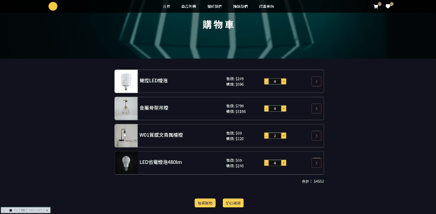
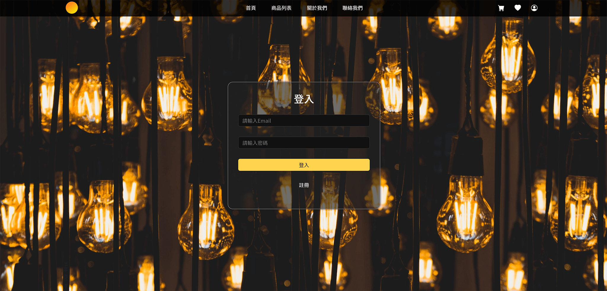
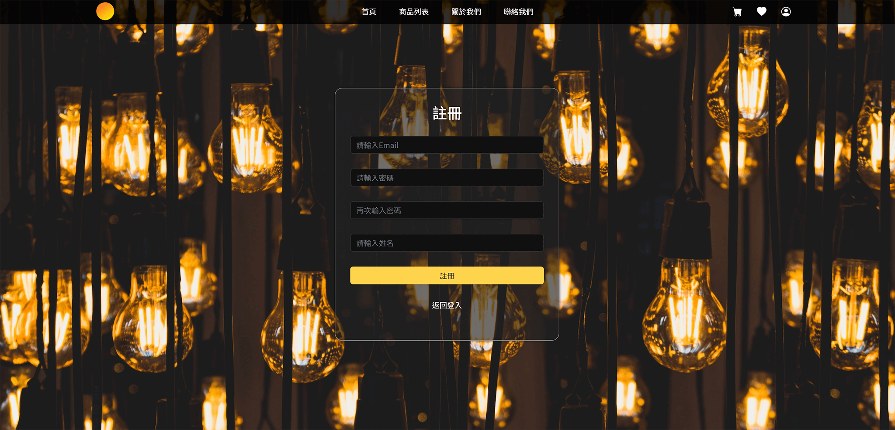
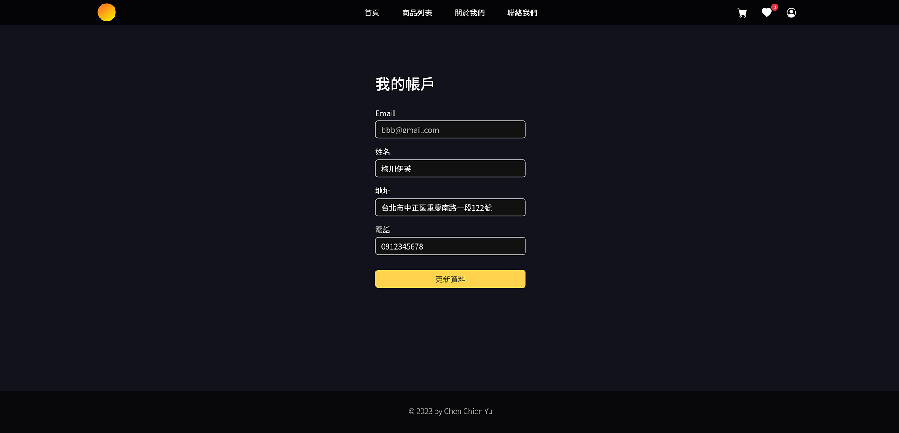
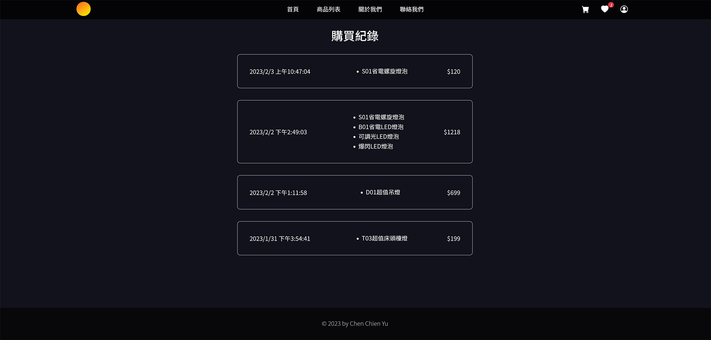
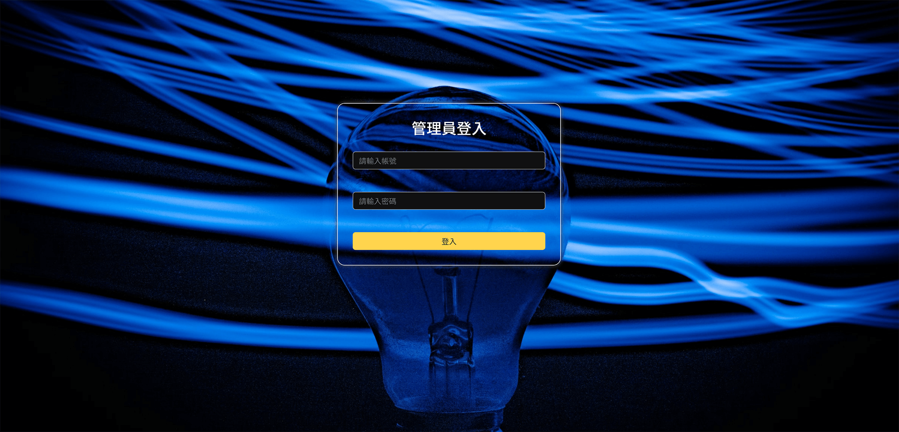
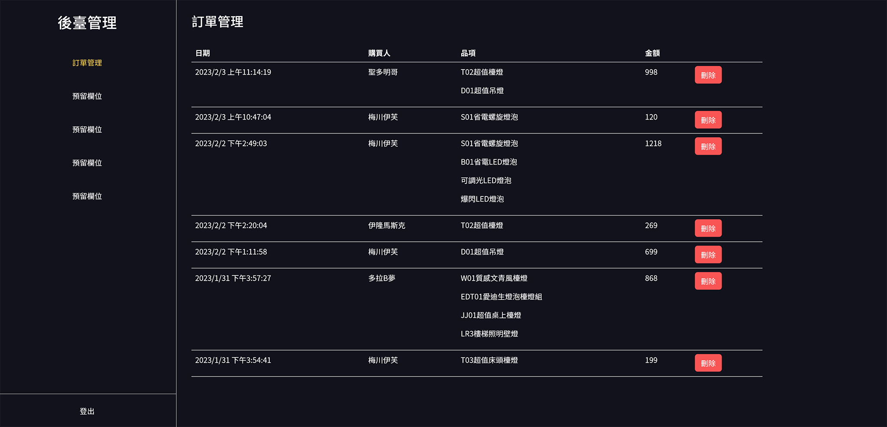

# 燈具電商網站
【DEMO : https://chienyuyu.github.io/light-bulb/ 】
  
包含會員系統的電商網站，可記錄個人購物車、收藏清單、購買紀錄、個人資料修改
  
※ 不支援無痕模式  
※ 部分ios設備瀏覽器須設定→ 取消阻擋cookie & 跨網站追蹤  
※ 後端部署於Render.com 超過15分鐘無人造訪會進入休眠模式，進行登入或註冊需耐心等待30秒左右等待服務器喚醒
  

******************
## 使用技術、套件

|  技術/套件   | 簡述  |
| :----- | :----- |
| Vue Cli   | 以 Vue.js 開發 SPA 網站 |
| VueRouter  | 設定路由 |
| Vuex  | 數據共享 |
| Bootstrap 5  | 格線系統使用、開發 UI 介面 |
| AOS  | 元件進場動畫 |
| Swiper  | 圖片輪播 |
|axios / fetch|串接後端資料|
| vue-sweetalert2  | 彈出提示窗 |
|Node.js / express| 撰寫API提供前端串接資料 |
|Firebase|資料庫儲存會員資料、訂單資料|
***
後端
https://github.com/ChienYuYu/bulb-backend-public
 
webServer 部署於 render.com  
商品資料使用JSON檔放置github
https://github.com/ChienYuYu/myJSON
******************

 

 

 

 

***
### 登入畫面

***
### 註冊畫面

***
### 帳戶資料畫面

***
### 購買紀錄

***
### 後台登入

***
### 簡易訂單管理畫面

***

後台網址 (僅提供訂單查看 && 刪除) 
https://chienyuyu.github.io/light-bulb/#/admin-login

demo 帳密  
帳號: admin  
密碼: abcd1234
*****************

 

圖片素材均來自cc0免版權圖庫 Unsplash、Pexels、Pixabay

所有內容純屬虛構、所有商品均無實際販售。